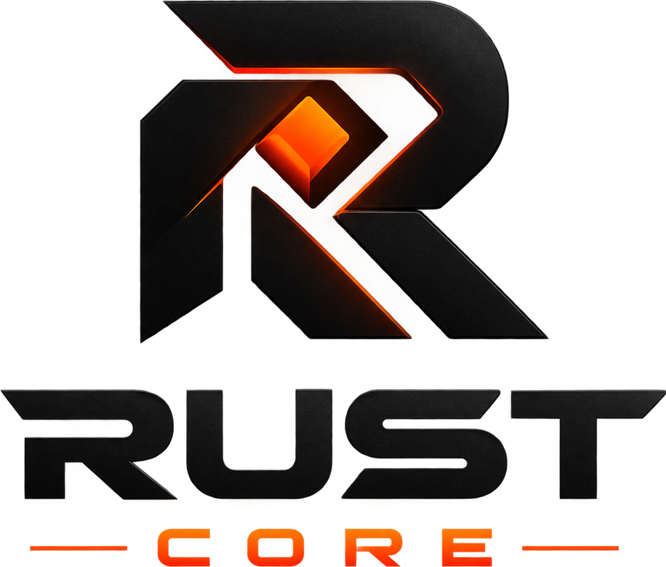

<p align="center">
  
</p>

<h1 align="center">RustCore Wallet</h1>

<p align="center">
  A self-custodial, transparent wallet for the <a href="https://massa.net">Massa</a> blockchain —
  the first product of the <b>RustCore</b> team.
</p>

<p align="center">
  
  
  
</p>

---

## Why RustCore Wallet

A wallet holds the keys to people's money, so "trust us" is not good enough. RustCore Wallet is
built on four principles:

- **Your keys never leave your phone.** Private keys are encrypted on your device with your PIN
  and are never sent anywhere — there is no RustCore server at all.
- **Everything is verifiable.** The full source code is public, so anyone can check exactly what
  the wallet does with your data — and confirm that it takes none.
- **What you see is what's on-chain.** Balances, rolls and history come straight from the
  blockchain. The wallet never shows a transaction as done before the network has executed it.
- **Served from the blockchain, too.** The wallet is hosted on
  [DeWeb](https://docs.massa.net/docs/deweb/home), Massa's decentralized web: its files are stored
  on-chain — there is no RustCore web server to take down or tamper with.

> **Version 1.0.0 — first production release** ([what's new](CHANGELOG.md)). RustCore Wallet
> works on Massa **mainnet with real funds**. It has not had an independent security audit yet:
> start with small amounts and always keep a backup of your private keys.

## What you can do

| | |
|---|---|
| 🔐 **Stay in control** | Your wallet is locked with a 6-digit PIN and encrypted on your phone. Create new wallets or import existing ones, and keep as many as you like. |
| 💸 **Send & receive** | MAS and Massa tokens. You always see a summary — amount, fee, recipient — before confirming. Receive with a QR code. |
| 🔄 **Swap** | Exchange tokens through the [Dusa](https://dusa.io) exchange, with a live quote and protection against price moves. |
| 🥩 **Stake** | Buy and sell rolls, see whether your wallet is staking, your produced and missed slots, the current APR and your estimated daily reward. |
| 🧾 **History** | Every transaction of your wallet, with full details and a link to the Massa explorer. |
| 🌐 **Domains** | See the `.massa` names your wallet owns. |
| 💲 **Prices** | Token values in USD, read directly from the Dusa exchange. |
| 📲 **Install it** | Add it to your home screen on Android or iPhone and it opens full screen, like a native app. |

Supported tokens: MAS, PUR, DUSA, USDC.e, WETH.e, DAI.e, WBTC.e, WETH.b, USDT.b — on Massa
Mainnet (and Buildnet, the test network).

## Getting started

RustCore Wallet runs in your **phone's browser** — Android or iPhone, any browser. On a computer
it shows a QR code to open it on your phone instead.

1. **Open it** on your phone at its official DeWeb address, which will be published here.
2. **Install it** (recommended): the wallet offers it at the top of the screen.
   - *Android* — tap **Install app**.
   - *iPhone / iPad* — tap **Share**, then **Add to Home Screen**. Do this **before** creating
     your wallet: on iOS the installed app keeps its own storage, separate from the browser.
3. **Create your PIN**, then **create a new wallet** or **import** one with its private key.
4. **Back up your private key right away**: *Settings → Backup private key*. Write it down and
   keep it offline — it's the only way to recover your wallet.

## Your security & privacy

**What stays on your phone**

- Your wallet, encrypted with your PIN (PBKDF2 with 300 000 iterations, then AES-GCM, using the
  browser's built-in Web Crypto). Without your PIN it can't be read. The PIN itself is never
  stored.
- While the wallet is unlocked, your keys live in memory only; locking it or closing the tab
  drops them.
- A short-lived cache of balances and history, encrypted the same way and deleted when the tab
  closes.

**What goes over the network — the complete list**

| Destination | Why |
|---|---|
| The DeWeb gateway you open the wallet from | Delivers the wallet itself, read from the Massa blockchain. |
| `mainnet.massa.net` / `buildnet.massa.net` | Massa's public nodes: balances, rolls, tokens, prices and swaps, and the transactions you confirm. |
| `explorer-api.massa.net` | Your transaction history. |

That's all: no RustCore servers, no analytics, no tracking. Links to `explorer.massa.net` and
`docs.massa.net` open only when you tap them.

**Built-in safeguards**

- Every transaction that spends funds shows a review screen and is checked first (balance, fee,
  address) — you confirm before anything is signed.
- Revealing a private key, removing a wallet or logging out asks for your PIN again.
- Swaps are sent with a minimum you'll accept, so the exchange cancels them instead of filling
  at a bad price.

**Good to know**

- A 6-digit PIN protects against casual access. If someone got hold of your phone's stored data,
  a determined attacker could try every PIN offline — keep your phone locked and secure.
- The wallet hasn't had an independent audit yet (it's on the [roadmap](#roadmap)).

### Verify it yourself

Every release is [published on GitHub](https://github.com/RustCoreMassa/rust-core-wallet/releases),
built in public from the source code, with checksums you can compare against a build of your own.
See [how to verify a build](docs/RELEASING.md#verifying-a-build).

## FAQ

**I forgot my PIN.** There is no PIN recovery — the PIN is what encrypts your wallet on the
phone, and nobody else has it. Clear this site's data in your browser settings (on iPhone,
remove the installed app from your home screen), open the wallet again and import your private
key from your backup.

**I lost my private key.** If you can still unlock the wallet, back the key up now under
*Settings → Backup private key*. Without the key and without access to the app, nobody —
including RustCore — can recover the funds.

**Is there a fee?** RustCore charges nothing. Each transaction pays the Massa network fee
(0.01 MAS), and swaps also send a small storage deposit required by the Dusa exchange
(0.1 MAS).

**Why doesn't it work on my computer?** It's built for phones. A browser extension for desktop is
on the roadmap.

## Roadmap

**Phase 1 — Web wallet** *(current)*
- [x] Encrypted multi-wallet vault with PIN
- [x] Send / receive MAS and Massa tokens
- [x] Transaction history with details
- [x] Staking: rolls, status, APR and rewards
- [x] Swaps through Dusa
- [x] `.massa` domains
- [x] Installable app (Android & iOS)
- [ ] Published on DeWeb
- [ ] NFT gallery
- [ ] Independent security audit
- [ ] Translations

**Phase 2 — Browser extension**
- [ ] Chrome / Brave / Edge and Firefox extension
- [ ] Connect to Massa dApps and sign their transactions, with a review screen
- [ ] Per-site permissions

**Phase 3 — Mobile apps**
- [ ] iOS and Android apps
- [ ] Biometric unlock (Face ID / fingerprint)
- [ ] Notifications for incoming transfers

**Later**
- [ ] Hardware-wallet support

## Support the project

RustCore Wallet is free and built in the open. If it's useful to you and you'd like to help fund
its development (the browser extension, mobile apps and a security audit), you can send a
voluntary donation in MAS or any Massa token to:

```
AU126s93ZxbT4QUJcZYqsAxyMc3wv8nkHJYKYCtgQyEnZ8VGRM99P
```

Donations are entirely optional and don't unlock any features — the wallet is the same for
everyone. Before sending, always check the address against this README in the official
repository — nobody from RustCore will ever DM you asking for funds or give you a different
address.

Not in a position to donate? Starring the repository, reporting bugs and spreading the word help
just as much.

## Contributing

Bug reports, ideas and pull requests are welcome — see [CONTRIBUTING.md](CONTRIBUTING.md) for how
to run the wallet locally and the rules that keep it safe.

## Security

Found a vulnerability? Please **don't open a public issue** — report it privately through
GitHub's
[private vulnerability reporting](https://docs.github.com/en/code-security/security-advisories/guidance-on-reporting-and-writing-information-about-vulnerabilities/privately-reporting-a-security-vulnerability)
("Report a vulnerability" on the repository's Security tab), with steps to reproduce, and give
us reasonable time to fix it before disclosing it publicly.

## License

RustCore Wallet is **source-available** under the
[Functional Source License, Version 1.1, ALv2 Future License](LICENSE.md) (FSL-1.1-ALv2).

In plain words (the [license text](LICENSE.md) is what legally applies):

- ✅ You **may** read, audit, run, modify and share the code — for yourself, for your company's
  internal use, for education and for research.
- ❌ You **may not** use it to offer a **competing product or service**: a wallet or service
  that substitutes for RustCore Wallet or offers substantially the same functionality.
- ⏳ **Each release becomes open source under Apache-2.0 two years after it is published.**

The names **"RustCore"** and **"RustCore Wallet"** and the RustCore logo are not licensed for
use in other products, including forks.

Copyright © 2026 Gicu Adasanu. All rights reserved except as granted by the license.

## Disclaimer

RustCore Wallet is provided "as is", without warranty of any kind. You are solely responsible for
your private keys and your funds: whoever holds a private key controls the funds, and lost keys
cannot be recovered by anyone. Blockchain transactions are irreversible. RustCore is not
affiliated with Massa Labs or Dusa.
